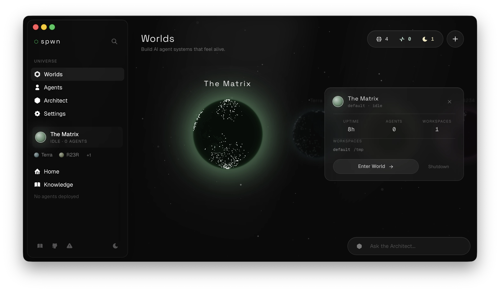

<p align="center">
  <strong>spwn</strong>
</p>

<p align="center">
  <a href="#quickstart"><strong>Quickstart</strong></a> &middot;
  <a href="https://spwn.sh/docs"><strong>Docs</strong></a> &middot;
  <a href="https://github.com/jterrazz/spwn"><strong>GitHub</strong></a> &middot;
  <a href="https://spwn.sh/manifesto"><strong>Manifesto</strong></a>
</p>

<p align="center">
  <a href="https://github.com/jterrazz/spwn/blob/main/LICENSE"></a>
  <a href="https://github.com/jterrazz/spwn/stargazers"></a>
  <a href="https://go.dev"></a>
  <a href="#"></a>
</p>

<br/>

<p align="center">
  
</p>

<br/>

## What is Spwn?

# Build AI agent systems that feel alive

**If OpenClaw is an _employee_, and Paperclip is the _company_, Spwn is the _world_.**

Spwn is a CLI and desktop app that runs AI agents inside isolated Docker worlds with persistent identity, physics-based security, and multi-agent coordination. You define the worlds. You define the rules. Your agents remember, adapt, and collaborate.

Models mastered thinking. Spwn builds the missing half: a reality for them to live in.

**Build worlds, not wrappers.**

|        | Step            | Example                                                            |
| ------ | --------------- | ------------------------------------------------------------------ |
| **01** | Create an agent | `spwn agent new neo`                                               |
| **02** | Spawn a world   | `spwn up --agent neo -w ./my-project`                              |
| **03** | Watch it live   | Agent discovers tools, works on your code, remembers everything.   |

<br/>

## Spwn is right for you if

- ✅ You're building **multi-agent systems** where agents collaborate, delegate, and communicate
- ✅ You want **reproducible agent setups** that are version-controllable and shareable
- ✅ You need **isolated, sandboxed environments** where agents can act without risk to your host
- ✅ You want agents with **persistent memory and identity** that evolve across tasks
- ✅ You want agents that **discover and compose tools** instead of calling pre-defined functions
- ✅ You want **physics-based security** — if curl isn't installed, HTTP is physically impossible
- ✅ You want **full visibility** into what your agents can do, what they learned, and what they're doing
- ✅ You want all of this **open source, self-hosted, on your machine**

<br/>

## Built on four principles

### 1. Context is everything
The #1 skill with AI is maximizing shared context — not prompting, not fine-tuning. Spwn's architecture exists to give agents the widest possible bandwidth: persistent profiles, knowledge bases, playbooks, and session memory.

### 2. CLI gives agents a body
A shell isn't just an interface — it's a nervous system. Every CLI domain becomes a new organ: file systems are touch, network is sight, databases are long-term memory. Agents don't call tools. They *feel* their environment and act through it.

### 3. One mind, one purpose
Identity creates focus. Each agent has a persistent role that shapes what it notices and what it ignores. Teams, companies, and hierarchies aren't configured — they emerge from the architecture, the same way they emerge in life.

### 4. Borrow from biology, not CS
Companies, sleep cycles, natural selection — these patterns aren't arbitrary. They're evolution's most refined solutions to coordination. Spwn applies them to agents: dream to learn, sleep to consolidate, fork to evolve.

<br/>

## Features

<table>
<tr>
<td align="center" width="33%">
<h3>🏗️ Multi-Agent Hierarchy</h3>
Leaders delegate to workers via inboxes. Workers report back. Ephemeral agents handle one-shot tasks. Flexible hierarchy, clear delegation.
</td>
<td align="center" width="33%">
<h3>📋 Declarative Config</h3>
org.yaml → world.yaml → profile.yaml. Cascading overrides. Version-controllable. Reproducible across machines.
</td>
<td align="center" width="33%">
<h3>🌍 Isolated Worlds</h3>
Every agent runs in a Docker world with its own filesystem, compute, and network. Real constraints. Real physics. No leaking into your host.
</td>
</tr>
<tr>
<td align="center">
<h3>🧠 Persistent Identity</h3>
Agents have a Profile: persona, traits, purpose, skills, knowledge, playbooks, journal. It survives across worlds. An agent that worked on your codebase last week remembers it today.
</td>
<td align="center">
<h3>🖥️ CLI + Desktop App</h3>
Full CLI for power users. Desktop app for visual monitoring. Command or click.
</td>
<td align="center">
<h3>🔌 Pluggable Everything</h3>
8 port interfaces with swappable adapters. Claude Code today, Pi tomorrow. Docker today, something else tomorrow. The core never changes.
</td>
</tr>
<tr>
<td align="center">
<h3>🔒 Physics-Based Security</h3>
No ACLs. No permission prompts. If curl isn't installed, HTTP doesn't exist — not "forbidden," physically impossible. You can't prompt-inject a missing binary.
</td>
<td align="center">
<h3>🧬 Agent Evolution</h3>
Dream, sleep, and fork. Agents analyze experience, consolidate knowledge, and branch into variants. Natural selection for behavior.
</td>
<td align="center">
<h3>📸 Snapshots & Rollback</h3>
Save a world at any point. Roll back to retry a different approach. Deterministic experimentation.
</td>
</tr>
</table>

<br/>

## The problem Spwn solves

| Without Spwn | With Spwn |
| --- | --- |
| ❌ No structure for managing multiple agents. You're wiring custom glue code and losing track. | ✅ Flexible hierarchy system — define roles, assign at deployment — with messaging, delegation, and activity log. |
| ❌ Your setup isn't reproducible or shareable. It works on your machine. | ✅ Declarative YAML config. `org.yaml` → `world.yaml` → `profile.yaml`. Git-friendly, shareable. |
| ❌ You can't see what tools and skills are exposed. What MCP servers? What capabilities? Nobody knows. | ✅ `/world/faculties.md` shows exactly what's physically possible. `spwn inspect` shows everything. |
| ❌ Zero governance. No cost limits. No resource constraints. No audit trail. | ✅ `org.yaml` defines governance. Cost limits, resource caps, allowed providers, activity log. |
| ❌ Your agent forgets everything between sessions. Every conversation starts from scratch. | ✅ Persistent identity — persona, skills, knowledge, playbooks, journal — survives across worlds. |
| ❌ One bad agent action and your host is compromised. | ✅ Fully isolated Docker worlds. Physics-based security. Snapshots and rollback. |

<br/>

## Why Spwn is different

|                                     |                                                                                                               |
| ----------------------------------- | ------------------------------------------------------------------------------------------------------------- |
| **Hierarchy over flat pools.**      | Architect → Universe → World → Hierarchy roles. Clear structure, clear delegation.                            |
| **Worlds over wrappers.**           | Not another API layer. A full environment with filesystem, compute, memory, and network.                      |
| **Identity over instances.**        | Agents have persistent purpose, traits, skills, and memory. They're individuals, not stateless functions.     |
| **Agency over tools.**              | MCP gives agents a Swiss Army knife. Spwn gives them a workshop. They discover, compose, and create.          |
| **Physics over permissions.**       | No ACLs. No allowlists. If curl isn't installed, HTTP is impossible. Security is structural.                  |
| **Evolution over configuration.**   | Agents learn from tasks via dream, consolidate knowledge during sleep, and branch via forking.                |

<br/>

## What Spwn is not

|                              |                                                                                                                       |
| ---------------------------- | --------------------------------------------------------------------------------------------------------------------- |
| **Not an agent framework.**  | We don't tell you how to build agents. We give them a world to live in.                                                |
| **Not a workflow builder.**  | No drag-and-drop pipelines. Spwn models worlds — with physics, identity, evolution, and communication.                 |
| **Not a sandbox.**           | Sandboxes contain. Worlds sustain. Agents in Spwn don't just run safely — they live, learn, and evolve.                |
| **Not a prompt manager.**    | Agents bring their own models and prompts. Spwn provides the environment they operate in.                              |
| **Not a chatbot.**           | Agents have worlds, not chat windows.                                                                                  |

<br/>

## Quickstart

Open source. Self-hosted. No account required.

```bash
# One-liner (downloads latest release to ~/.local/bin)
curl -fsSL https://spwn.sh/install.sh | bash
```

```bash
# Create an agent
spwn agent new neo

# Spawn a world with the agent inside
spwn up --agent neo -w ./my-project --detach

# Talk to the agent
spwn agent talk neo "What is this project?"

# Check the environment
spwn ls
```

A Docker container is created. The agent's persistent profile is mounted inside. The runtime (Claude Code by default) is spawned with full shell access. The agent reads its briefing, understands its role, and starts working.

Or build from source:

```bash
git clone https://github.com/jterrazz/spwn.git && cd spwn
make install
```

> **Requirements:** Go 1.25+, Docker

<br/>

## Use Cases

### Team with a leader

```bash
spwn up --leader morpheus --agent neo --agent trinity -w ./acme-api
spwn msg send neo --from morpheus "Implement Stripe webhooks"
spwn msg send trinity --from morpheus "Write tests for webhooks"
```

### Organization-wide governance

```yaml
# org.yaml
governance:
  max-worlds: 10
  max-agents-per-world: 8
  allowed-providers: [anthropic, openai]
  cost-limit: $50/day
```

### Solo developer

```bash
spwn up --agent neo -w ./my-app
spwn agent talk neo "Refactor the auth module to use sessions"
# neo works on it, remembers the codebase next time
```

### Multi-runtime

```bash
spwn up --agent neo --runtime pi -w .           # Pi runtime
spwn up --agent smith --runtime aider -w .       # Aider for code review
spwn up --agent oracle --runtime codex -w .      # OpenAI Codex
```

<br/>

## Agent Identity

The agent's identity is a directory of markdown files — human-readable, version-controllable, no database.

```
~/.spwn/agents/neo/
├── profile.yaml              # role, engine, identity, requires, delegation
├── identity/                 # who the agent is
│   ├── persona.md            # role, style, preferences
│   ├── purpose.md            # mission and goals
│   └── traits.md             # values and behavioral traits
├── skills/                   # what the agent can do
├── memory/                   # what the agent knows and remembers
│   ├── knowledge/            # facts about the codebase
│   ├── playbooks/            # step-by-step workflows
│   └── journal/              # session logs
├── sessions/                 # active session state
└── bonds.md                  # relationships with other agents
```

| Biology | Layer | What it stores |
|---------|-------|----------------|
| Personality | **Persona** | Who I am — role, style, preferences |
| Core values | **Traits** | What I believe — values and behavioral traits |
| Mission | **Purpose** | Why I exist — mission and goals |
| Skills | **Skills** | What I can do — procedures, checklists |
| Semantic memory | **Knowledge** | What I know — facts about the codebase |
| Procedural memory | **Playbooks** | How I do things — step-by-step workflows |
| Episodic memory | **Journal** | What happened to me — session logs |
| Working memory | **Sessions** | Active session state |
| Social | **Bonds** | Who I know — relationships with other agents |

<br/>

## Evolution

Agents evolve through three mechanisms:

- **Dream** (`spwn agent dream <name>`) — Analyzes experience, discovers patterns, promotes successful strategies to playbooks. Failed ones are discarded. Natural selection for behavior.
- **Sleep** (`spwn agent sleep <name>`) — Graceful shutdown — saves state, archives stale files, prunes old sessions. Raw experience consolidates into durable knowledge.
- **Fork** (`spwn agent fork <src> <dst>`) — Clones an agent. Run copies in different environments, keep the branch that performs best.

> *"Every task leaves a trace. Every trace becomes knowledge. Every knowledge shapes the next decision."*

<br/>

## World Physics

The world manifest defines what is physically possible:

```yaml
physics:
  constants:
    cpu: 2
    memory: 1GB
    timeout: 30m

tools:
  - @spwn/unix          # bash, coreutils, grep, sed, awk
  - @spwn/git           # version control
  - @spwn/node          # Node.js 20 + npm
  - @spwn/claude-code   # AI agent runtime
  - @spwn/cli           # spwn CLI
  - @spwn/qmd           # on-device markdown search

gate:
  - source: mcp/slack
    as: slack-send
    capabilities: [send]
```

If `curl` is not in the tools list, it does not exist. Tools are composable, dependency-aware, and verified at world creation. Each tool ships its own skills (Vercel SKILL.md convention). The image is built on-demand from your exact tool selection — no bloated base images.

<br/>

## Tool Catalog

Spwn worlds are assembled from composable tools. Each tool is a self-contained plugin: it knows how to install itself, how to verify it works, and what skills to teach the agent. You pick only what you need — the imagebuilder resolves dependencies, deduplicates packages, and produces a single optimized Docker image.

Tools are stackable. `@spwn/qmd` depends on `@spwn/node` — list `@spwn/qmd` and Node.js appears automatically. Adding a new tool to the ecosystem is one directory and one Go interface.

### SDKs

Language runtimes and core system utilities.

| Tool | What it provides | Use when | Status |
|------|-----------------|----------|--------|
| `@spwn/unix` | bash, coreutils, grep, sed, awk, curl, jq | You need standard shell tools | Available |
| `@spwn/node` | Node.js 20, npm, npx | Your project uses JavaScript/TypeScript | Available |
| `@spwn/python` | Python 3, pip | Your project uses Python | Available |
| `@spwn/build` | make, gcc, g++ | You need to compile C/C++ | Available |

### Runtimes

The thinking engine that drives the agent. Pick one per agent.

| Tool | What it provides | Use when | Status |
|------|-----------------|----------|--------|
| `@spwn/claude-code` | Claude Code CLI + pre-configured auth | You want Anthropic's agent runtime (default) | Available |
| `@spwn/codex` | Codex CLI + pre-configured workspace trust | You want OpenAI models (GPT-5, o3) | Available |
| `@spwn/aider` | Aider CLI | You want an open-source code-focused runtime | Planned |

### Tools

Extra capabilities you add to a world. Each ships skills that teach the agent how to use it.

| Tool | What it provides | Use when | Status |
|------|-----------------|----------|--------|
| `@spwn/git` | Git version control | You need source control (almost always) | Available |
| `@spwn/docker-cli` | Docker CLI (DooD) | The agent needs to manage containers | Available |
| `@spwn/qmd` | [QMD](https://github.com/tobi/qmd) on-device search | The agent needs to search docs, notes, or knowledge bases locally | Available |

### Platform

Spwn's own infrastructure. Usually included by default — listed here because you can opt out.

| Tool | What it provides | Use when | Status |
|------|-----------------|----------|--------|
| `@spwn/cli` | spwn CLI inside the world | The agent needs to manage its own identity, messages, or sub-worlds | Available |
| `@spwn/architect` | Full orchestration daemon (includes @spwn/cli, @spwn/claude-code, @spwn/docker-cli) | You're running the always-on Architect | Available |

### Adding your own tools

Every tool implements one Go interface:

```go
type Tool interface {
    Name() string           // "@spwn/mytool"
    Kind() Kind             // runtime, tool, sdk, platform
    Version() string        // semver or "latest"
    Dependencies() []string // other tools this requires
    Install() InstallSpec   // apt packages, RUN commands, files
    Verify() []string       // commands that must exit 0
    Skills() fs.FS          // SKILL.md + references (or nil)
}
```

Create a directory under `core/imagebuilder/catalog/mytool/`, implement the interface, add it to `catalog.go`. The test framework validates your tool automatically — contract tests check invariants, E2E tests build a real image and verify binaries exist inside it.

<br/>

## CLI Reference

### World Operations (top-level)

```
spwn up --agent neo -w .              Spawn a world with an agent
spwn ls                               List active worlds
spwn inspect <id>                     Show world details and physics
spwn down <id>                        Destroy a world (agent survives)
spwn logs <id>                        Stream agent output
spwn attach <id>                      Interactive shell
```

### Agent Management

```
spwn agent new <name>                 Create a new agent
spwn agent ls                         List all agents
spwn agent rm <name>                  Remove an agent
spwn agent talk <name> [message]      Talk to a running agent
spwn agent dream <name>               Analyze experience, promote playbooks
spwn agent sleep <name>               Shutdown — save state, consolidate
spwn agent fork <src> <dst>           Clone an agent
spwn agent export <name>              Export agent as tar.gz
spwn agent import <file>              Import agent from tar.gz
```

### Profile (character sheet)

```
spwn profile <name>                   Show full character sheet
spwn profile <name> purpose           Show/edit purpose
spwn profile <name> traits            Show/edit traits
spwn profile <name> persona           Show/edit persona
spwn profile <name> bonds             Show/edit bonds
spwn profile <name> skills            List skills
spwn profile <name> playbooks         List playbooks
spwn profile <name> knowledge         List knowledge
spwn profile <name> journal           Session history
```

### Messaging, Snapshots & System

```
spwn msg send <agent> --from <sender> "msg"   Send message to agent
spwn msg inbox <agent>                         Show agent inbox
spwn msg watch <agent>                         Watch for new messages

spwn snap save <id>                   Save world state
spwn snap ls                          List snapshots
spwn snap restore <snap>              Restore from snapshot

spwn architect start|stop|status      Your always-on world builder
spwn dash start|open                  Visual dashboard
```

Use `spwn <command> --help` for full details on any command.

<br/>

## Comparison

| | Approach | What Spwn adds |
|---|---------|----------------|
| **LangChain / CrewAI** | Chains function calls | Emergent behavior, not deterministic chains |
| **Claude Code** | Runs on your machine | Isolation, physics-based security, persistent profile |
| **E2B** | Cloud sandboxes | Self-hosted, persistent identity, evolution |
| **MCP** | Exposes tools one at a time | Full shell — N! compositions, not N tools |
| **Docker** | Container runtime | Agent lifecycle, identity, Gate, evolution |

Spwn is not a competitor to Claude Code — it is the complement. Claude Code is the intelligence. Spwn is the world to be intelligent in.

<br/>

## Runtime Adapters

Spwn treats agent runtimes as swappable adapters. The container-side Gate speaks [ACP](https://github.com/agentclientprotocol/agent-client-protocol), so adding a new runtime is a container image change.

| Runtime | Base Image | Status |
|---------|-----------|--------|
| Claude Code | node:20 | Available |
| Pi | node:20 | Available |
| Aider | python:3.12-slim | Available |
| Codex | node:20 | Planned |
| OpenCode | debian:bookworm-slim | Planned |
| Gemini | node:20 | Planned |

<br/>

## Architecture

Multi-module Go monorepo with Ports and Adapters architecture. 8 port interfaces, each with swappable adapters:

| Port | What it abstracts | Default adapter |
|------|-------------------|-----------------|
| Runtime | How agents think | Claude Code (ACP) |
| Provider | Which LLM | Anthropic |
| Backend | Where worlds run | Docker |
| Channel | External communication | CLI |
| Memory | How profiles persist | Filesystem (markdown) |
| Store | How state is tracked | JSON file |
| Tool | What agents can do | Built-in + MCP |
| Skill | Reusable capabilities | Local files |

```
spwn/
├── core/                       Domain libraries
│   ├── universe/                 World management, ports & adapters
│   ├── imagebuilder/             Composable Docker images, tool catalog
│   ├── agent/                    Agent lifecycle, profile, evolution
│   ├── gate/                     Host-container bridge
│   ├── messenger/                Inter-agent messaging
│   └── foundation/               Primitives (paths, IDs, constants)
├── apps/
│   ├── cli/                      The spwn binary
│   └── observatory/              Desktop app (Next.js + Tauri)
└── platform/
    ├── gate-runtime/             Container-side Rust gate
    └── fixtures/                 Test fixtures
```

<br/>

## Roadmap

- ✅ World creation and isolation
- ✅ Persistent agent identity and memory
- ✅ Agent evolution (dream, sleep, forking)
- ✅ Multi-agent coordination and messaging
- ✅ Snapshots and rollback
- ✅ CLI and desktop app
- ✅ Pluggable runtime adapters (Claude Code, Pi, Aider)
- ✅ Activity log and audit trail
- ✅ Composable tool catalog with imagebuilder
- ⚪ Marketplace — share and import world templates, tool packs
- ⚪ Cloud-hosted worlds
- ⚪ Multi-universe federation
- ⚪ Mobile app

<br/>

## Community

- [Website](https://spwn.sh) — Home
- [Docs](https://spwn.sh/docs) — Full documentation
- [Manifesto](https://spwn.sh/manifesto) — The philosophy behind Spwn
- [GitHub Issues](https://github.com/jterrazz/spwn/issues) — Bugs and feature requests
- [Contributing](CONTRIBUTING.md) — How to contribute

<br/>

## License

MIT © 2025 Spwn

<br/>

---

<p align="center">
  <sub>Open source under MIT. Built for people who want to give agents a world, not a wrapper.</sub>
</p>
